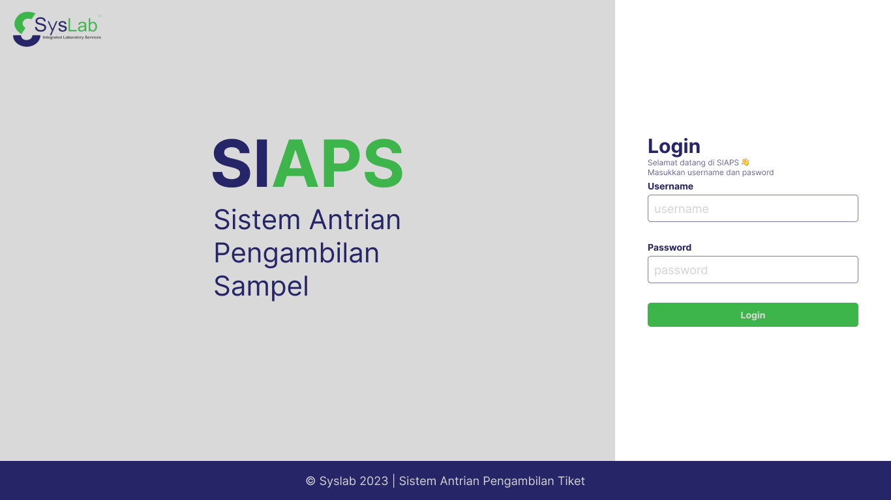
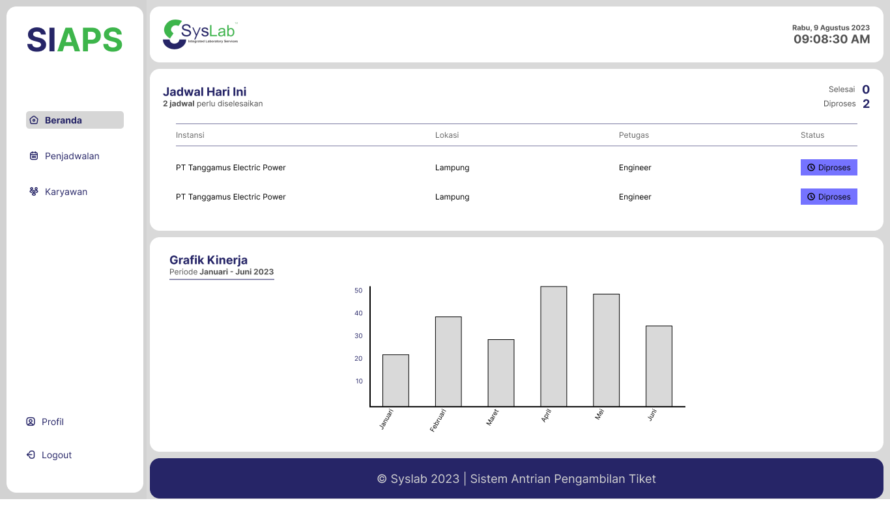
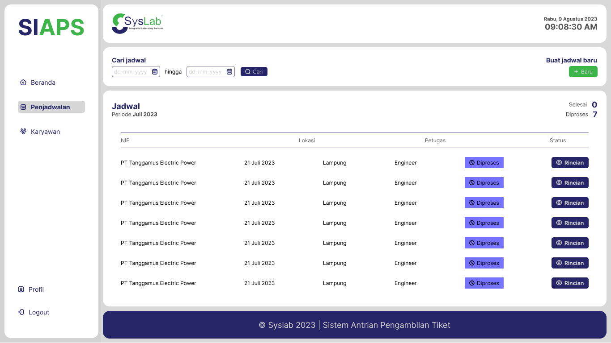
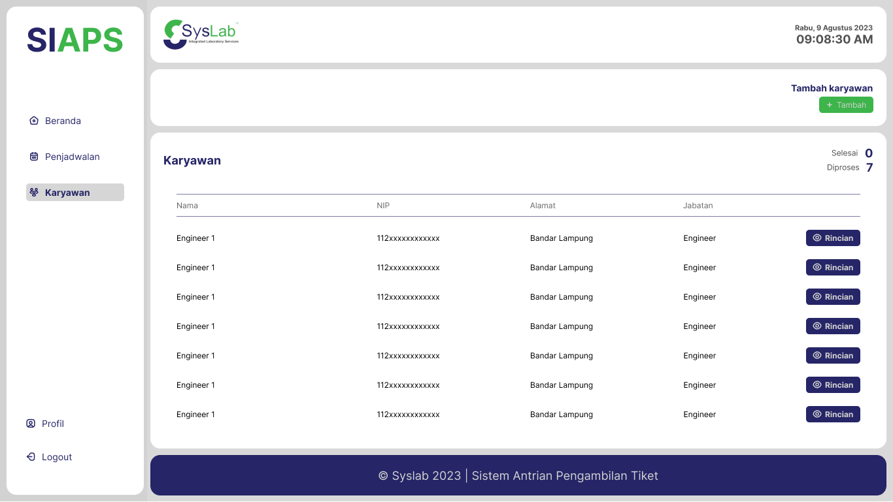

# SIAPS (Sistem Antrian Pengambilan Sampel)

SIAPS adalah sistem yang didesain untuk mampu menangani pembuatan tiket pengambilan sampel untuk PT Syslab Lampung.

## Fitur SIAPS

#### Fitur Login

Fitur login adalah fitur untuk memastikan keamanan dari akses terhadap sistem SIAPS. Perlu diketahui fitur ini bisa diakses oleh anggota PT Syslab Lampung dan sudah memiliki akun yang terdaftar dalam sistem SIAPS.

#### Beranda

Beranda merupakan fitur pertama yang akan dilihat oleh pengguna terkhusus admin pada saat pertama mengakses sistem SIAPS. Selain itu pada side-bar, pengguna dapat melihat beberapa pilihat fitur yang dapat diakses oleh pengguna (Admin) dimulai dengan penjadawalan, karyawan dan profil.

#### Penjadwalan

Fitur ini ditujukan untuk mampu menampilkan jadwal dari pengambilan sampel dimana dalam fitur ini memiliki beberapa sub fitur untuk pembuatan jadwal dan lihat detail jadwal.

#### Karyawan

Fitur pengelolaan data karyawan dilengkapi dengan fitur tampilan daftar karyawan, lihat detail karyawan dan edit data karyawan.

<!-- - [@vitejs/plugin-react](https://github.com/vitejs/vite-plugin-react/blob/main/packages/plugin-react/README.md) uses [Babel](https://babeljs.io/) for Fast Refresh
- [@vitejs/plugin-react-swc](https://github.com/vitejs/vite-plugin-react-swc) uses [SWC](https://swc.rs/) for Fast Refresh -->
